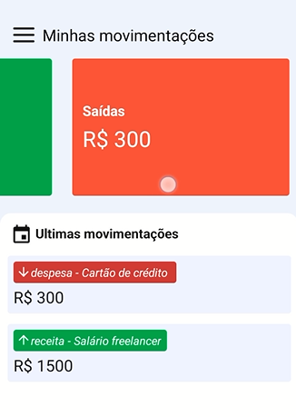

<h1 align="center"> App de Finanças </h1>

App criado para quem quer facilidade e manter suas contas controladas, não necessariamente precisando preencher planilhas e realizar contas.  

  <a href="#-tecnologias">Tecnologias</a>&nbsp;&nbsp;&nbsp;|&nbsp;&nbsp;&nbsp;
  <a href="#-projeto">Projeto</a>&nbsp;&nbsp;&nbsp;|&nbsp;&nbsp;&nbsp;
  <a href="#-layout">Layout</a>&nbsp;&nbsp;&nbsp;|&nbsp;&nbsp;&nbsp;

 

  
  

## 🚀 Tecnologias

Esse projeto foi desenvolvido com as seguintes tecnologias:

- HTML e CSS
- React native
- Git e Github
- Figma

## 💻 Projeto

Com sistema de cadastro de usuário, funcionalidades como adicionar movimentações, deletar, filtrar datas, verificar o perfil de quem está logado e realizar logout, utilizando o expo android, rotas, funções assíncronas, validações via token, banco de dados utilizado prisma - sqlite, programas usados para testes Insomnia, Beekeeper Studio.
